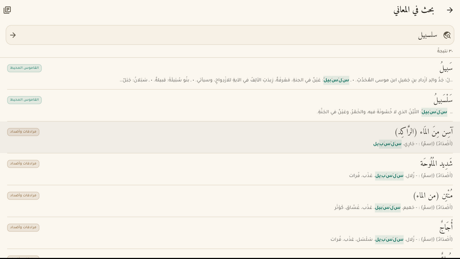

# قاموس المعاني — Qamus al-Maani

یو آفلاین عربي–عربي قاموس چې په ډارټ/فلټر کې لیکل شوی دی او د **وینډوز، اندروید او
iOS** لپاره جوړېږي. ټول ۲۱۹٬۷۶۴ مدخلونه له شپږو معاجمو څخه په اپلکیشن کې دننه دي —
هېڅ انټرنټ ته اړتیا نشته.

An offline Arabic–Arabic dictionary: 219,764 entries drawn from six classical and
modern lexicons, packed into a single 15 MB asset that ships inside the app.


| | |
|---|---|
|  |  |
| *live results, collapsed by headword* | *every sense, grouped by source* |
|  |  |
| *the definition sweep, with matches picked out* | *deep ink, by night* |

---

## څه شی لري / What it does

| | |
|---|---|
| **ژوندی لټون** | له لومړي حرف څخه سمدستي وړاندیزونه؛ ټول شکلونه د یوې کلمې لاندې راټولېږي |
| **د پای لټون** | «ينتهي بـ» — ووایه چې کومې کلمې په «يب» پای ته رسېږي، او سمدستي یې ترلاسه کړه |
| **د کتاب فلټر** | یو معجم، څو، یا ټول شپږ — لټون یوازې هغو کې کیږي چې ټاکل شوي وي |
| **مشابه کلمې** | د هرې کلمې په پای کې د هغه جذر مشتقات او نږدې کلمې، په یو کلیک سره |
| **د شرحو لټون** | د معناګانو په متن کې لټون — هغه کلمه ومومه چې مدخل نه دی، خو په شرح کې راغلې |
| **د جذرونو تصفح** | لکه چاپي قاموس: جذر وټاکه، ټول مشتقات یې وګوره |
| **محفوظات** | نښه شوې کلمې او د لټون تاریخچه |
| **ښکلی ښکارېدل** | د پارچمنټ رڼا او د تور مرکب شپه، Amiri خط، بشپړ RTL |

### Six source lexicons

| معجم | مدخلونه |
|---|---|
| معجم اللغة العربية المعاصرة | 53,018 |
| معجم الرائد | 46,764 |
| معجم الوسيط | 43,109 |
| مرادفات وأضداد | 36,906 |
| معجم الغني | 29,681 |
| القاموس المحيط | 10,286 |

---

## د ډېټابیس کمپریشن / How the corpus got small

خام ډېټابیس **۱۷۰.۶ MB** و. هغه څه چې اپلکیشن یې لېږدوي **۱۵.۲ MB** دي — **۱۱.۳ ځله
کوچنی**. دا په څلورو ګامونو ترسره شو:

The raw `AlmaanyArArV11.db` is **170.6 MB**. What the app ships is **15.2 MB** —
**11.3× smaller** — through four decisions, none of which cost a millisecond at
lookup time:

1. **Solid definition blocks.** The 51.7 MB of Arabic definition text is stored
   as deflate blocks of 512 consecutive entries, ordered by *(book, root, word)*
   so that neighbouring entries share vocabulary and formatting. That ordering
   alone buys ~9%. Result: **51.7 MB → 13.6 MB (3.8×)** in 430 blocks.
   Deflate is used rather than LZMA because `dart:io` exposes zlib natively, so
   inflating one block costs about a millisecond and pulls in no native
   dependency. A small LRU keeps the last few blocks resident, which makes
   walking a root essentially free.
2. **Nothing derivable is shipped.** The normalised search key `k`, its reversal
   `kr` (which turns a suffix query into a prefix scan), and all four indexes are
   absent from the asset. The app materialises them once, on first launch, in a
   background isolate.
3. **`xz -9e` over the whole file.** 20.7 MB of SQLite → **15.2 MB**.
   Pure-Dart XZ decoding takes ~1.7 s on a desktop; it happens exactly once.
4. **Subset fonts.** Amiri and Tajawal are cut down to the Arabic ranges plus
   basic Latin: **1.03 MB → 546 KB**, with all shaping features intact.

Rebuild the asset from a source corpus with:

```bash
python3 tools/build_db.py /path/to/AlmaanyArArV11.db -o app/assets/db/qamus.db
```

### Schema

```sql
books  (id, name, dict, n)
roots  (id, r)
entries(id, w, rid, b, k, kr)   -- k / kr filled in on the device
chunks (id, z)                  -- 512 definitions per deflate block
```

`entries.id` is assigned in packing order, so a definition's location is pure
arithmetic: block `id / 512`, slot `id % 512`. No join, no lookup table.

### Searching

Arabic readers type without diacritics and rarely agree on hamza seats, so every
query and every headword is folded through one normaliser
(`lib/src/data/arabic.dart`): marks and tatweel stripped, `أإآٱ→ا`, `ىئ→ي`,
`ؤ→و`, `ة→ه`, standalone hamza dropped, everything non-letter discarded. `شَيْء`
and `شي` land on the same key; so do `ذِئْب` and `ذيب`.

That single fold gives all five modes off two B-tree indexes:

| Mode | Query |
|---|---|
| يبدأ بـ | `k >= key AND k < key+￿` |
| ينتهي بـ | the same range scan over `kr`, the reversed key |
| يحتوي على | `k LIKE '%key%'` |
| مطابق تمامًا | `k = key` |
| الجذر | join through `roots` |

Prefix search lands in well under a millisecond; suffix search in about two.
The definition sweep ("بحث في المعاني") has no index to lean on — it inflates all
430 blocks — so it runs in its own isolate and streams hits in as it finds them.

---

## جوړول / Building

```bash
cd app
flutter pub get
flutter test                       # 29 tests, run against the real corpus
flutter run -d windows             # or android, or ios
```

Release builds, all with obfuscation, split debug symbols and icon tree-shaking:

```bash
flutter build apk       --release --split-per-abi --obfuscate --split-debug-info=build/symbols --tree-shake-icons
flutter build windows   --release --obfuscate --split-debug-info=build/symbols --tree-shake-icons
flutter build ios       --release --no-codesign --obfuscate --split-debug-info=build/symbols --tree-shake-icons
```

Regenerate the launcher icons after changing the mark:

```bash
python3 tools/make_icons.py
```

> Building for **Linux** additionally downloads the SQLite amalgamation through
> CMake `FetchContent`, so that target needs network access at configure time.
> Android, Windows and iOS use prebuilt or vendored SQLite and do not.

---

## CI artifacts

`.github/workflows/build.yml` analyzes, tests, then builds all three targets.
Each job packs its output as a **`.tar.xz`** compressed with `xz -9e`, and uploads
it with `compression-level: 0` — GitHub always wraps artifacts in a zip, and
re-deflating an LZMA stream only makes it bigger. Pushing a `v*` tag additionally
publishes the three archives as a GitHub release.

| Artifact | Contents |
|---|---|
| `qamus-android` | per-ABI APKs + AAB |
| `qamus-windows` | the release bundle |
| `qamus-ios` | unsigned `.ipa` |

---

## Layout

```
app/
  lib/src/data/     arabic.dart · bootstrap.dart · dictionary.dart · models.dart · settings.dart
  lib/src/ui/       home · entry · roots · deep_search · saved · settings · books_sheet
  lib/src/theme.dart
  assets/db/        qamus.db.xz          the packed corpus
  assets/fonts/     Amiri · Tajawal      subset to the Arabic ranges
  test/             arabic · dictionary · app
tools/
  build_db.py       corpus  ->  packed asset
  make_icons.py     the launcher mark, for every platform slot
```

## Licences

The Amiri and Tajawal typefaces are used under the SIL Open Font License 1.1;
their licence texts ship in `app/assets/licenses/` and are reachable from the
app's settings screen. The dictionary content belongs to its respective
publishers.
