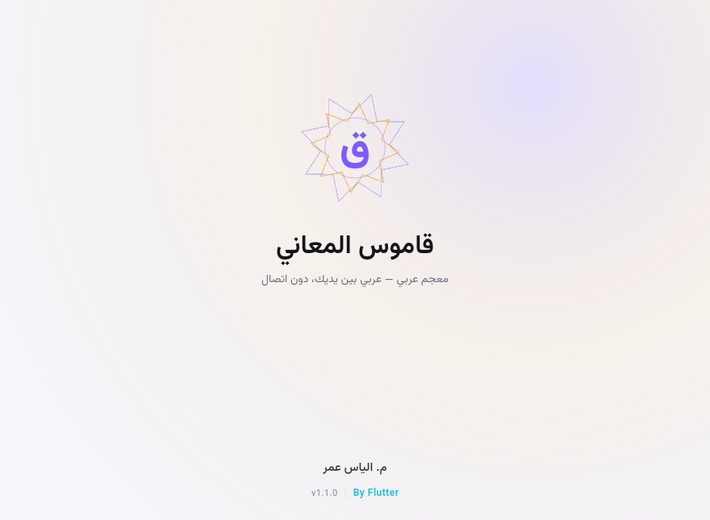
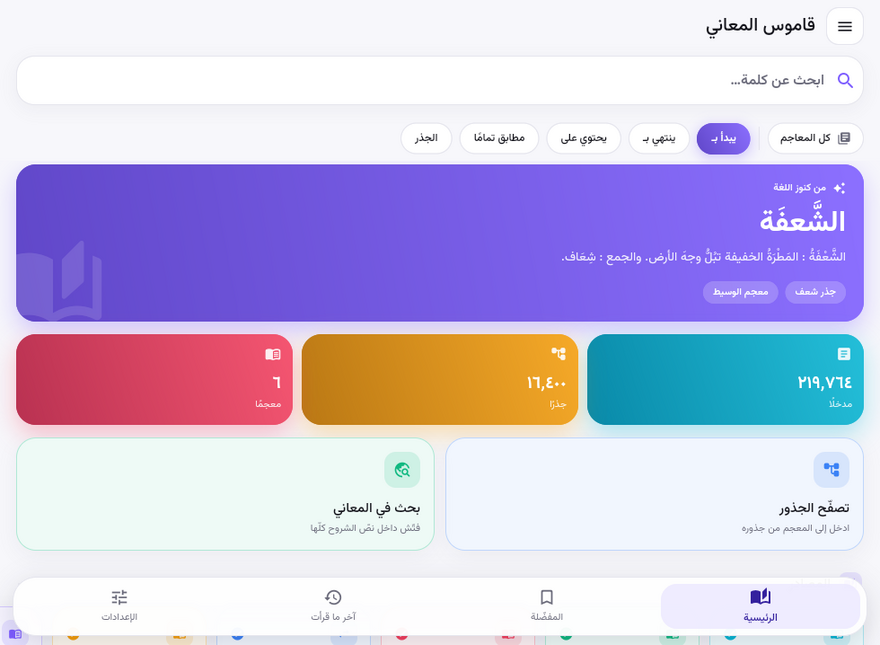
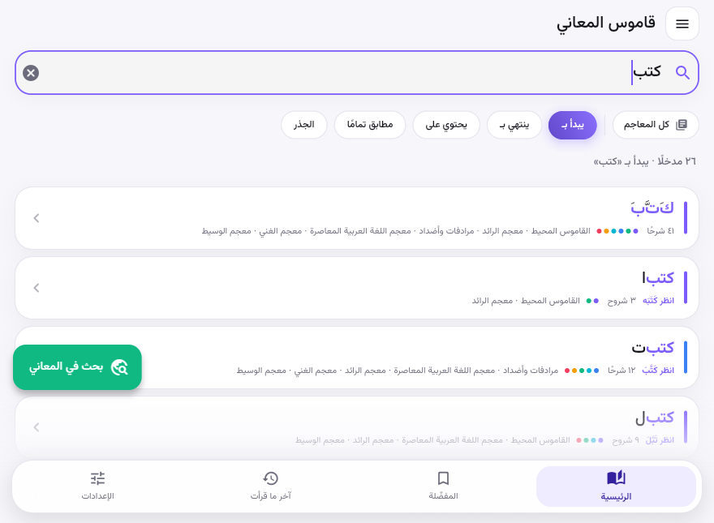
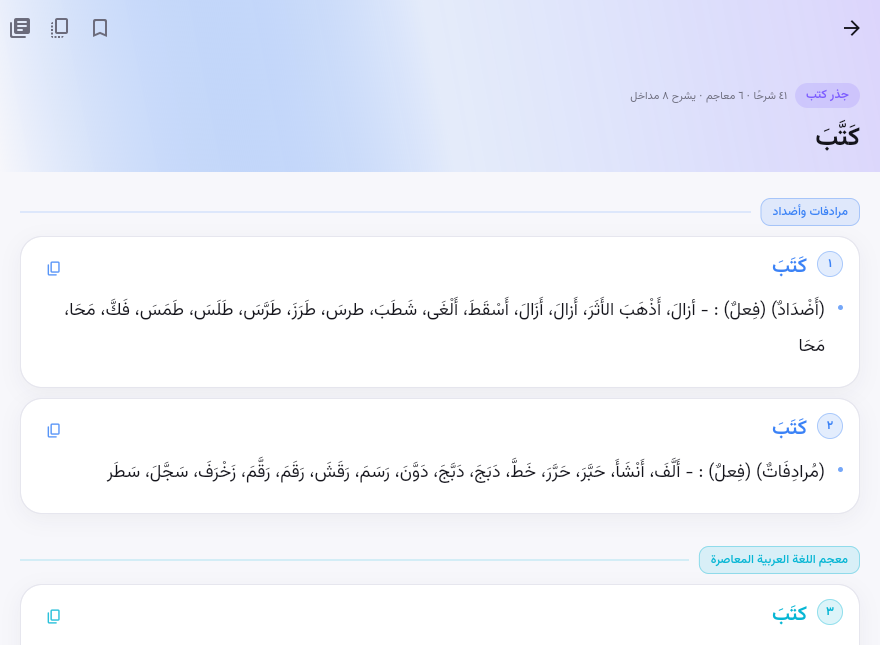
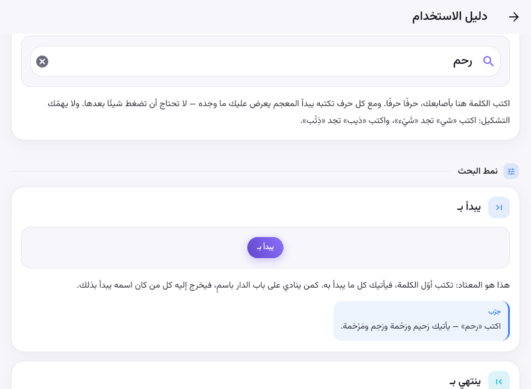
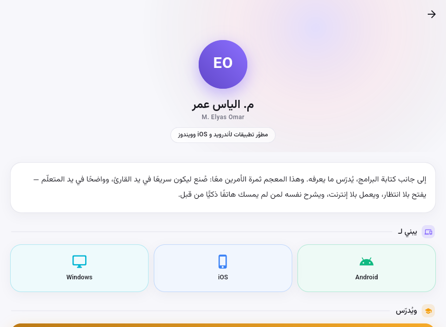
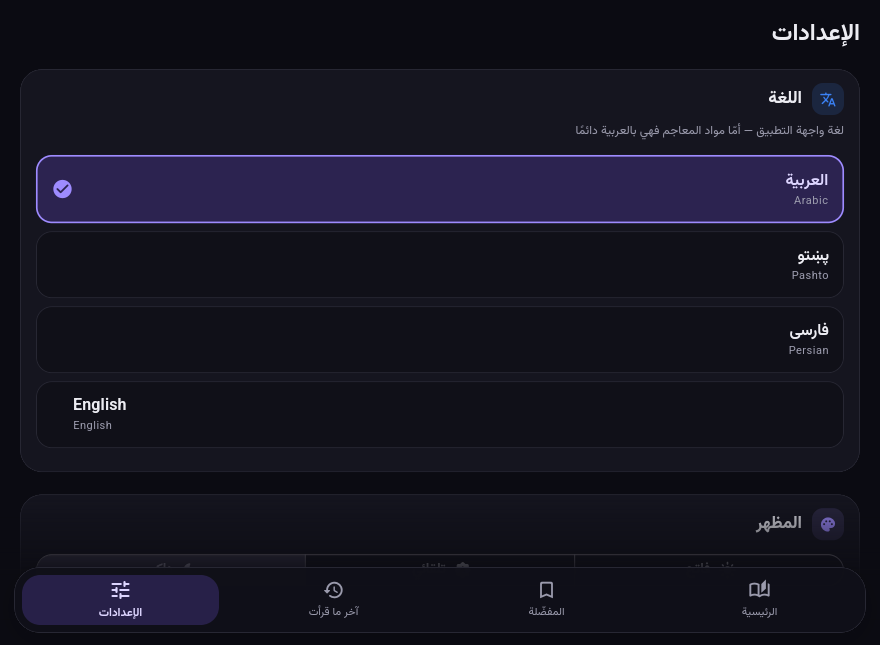

# قاموس المعاني — Qamus al-Maani

یو آفلاین عربي–عربي قاموس چې په ډارټ/فلټر کې لیکل شوی دی او د **وینډوز، اندروید او
iOS** لپاره جوړېږي. ټول ۲۱۹٬۷۶۴ مدخلونه له شپږو معاجمو څخه، او د سرچینې ۱۷۶٬۰۳۶
صرفي بڼې — یو حرف هم نه دی حذف شوی — په ۱۱ MB کې بند دي. هېڅ انټرنټ ته اړتیا نشته.

An offline Arabic–Arabic dictionary: 219,764 entries from six lexicons and the
source's 176,036-form morphological index, packed into a 10.9 MB asset with
**not one character removed**, and an interface that speaks Pashto, Persian,
Arabic and English.


| | |
|---|---|
|  |  |
| *the mark, the name, the author, the build* | *word of the day, corpus at a glance, the six lexicons* |
|  |  |
| *live results, collapsed by headword* | *every definition numbered, each one copyable on its own* |
|  |  |
| *the manual shows the real control, then explains it plainly* | *who made it, and three ways to reach him* |
|  | |
| *near-black by night, with the navigation curtain* | |

---

## څه شی لري / What it does

| | |
|---|---|
| **څلور ژبې** | عربي (ډیفالټ)، پښتو، فارسي، انګلیسي — هر توری د اپلیکیشن ژباړل کیږي |
| **ژوندی لټون** | له لومړي حرف څخه سمدستي وړاندیزونه؛ ټول شکلونه د یوې کلمې لاندې |
| **د پای لټون** | «ينتهي بـ» — ووایه چې کومې کلمې په «يب» پای ته رسېږي |
| **د کتاب فلټر** | یو معجم، څو، یا ټول شپږ |
| **مشابه کلمې** | د جذر مشتقات او نږدې کلمې، په یو کلیک |
| **د شرحو لټون** | د معناګانو په متن کې لټون |
| **د جذرونو تصفح** | لکه چاپي قاموس: جذر وټاکه، مشتقات یې وګوره |
| **محفوظات** | نښه شوې کلمې او د لوستلو تاریخچه |
| **شمېرل شوي تفصیلات** | هر شرح خپل عدد لري، او خپله د کاپي تڼۍ — د معجم له نامه سره |
| **د کارونې لارښود** | هر افشن په ساده ژبه، د خپلې ریښتینې بڼې او مثال سره |
| **د پروګرامر پاڼه** | م. الیاس عمر — واټساپ، ټلګرام، بریښنالیک، هر یو په یوه کلیک |
| **مډرن ډیزاین** | سپین/تور بک ګراند، رنګین کارټونه، نرم انمیشنونه، ټولټیپونه |

### Six source lexicons

| معجم | مدخلونه |
|---|---|
| معجم اللغة العربية المعاصرة | 53,018 |
| معجم الرائد | 46,764 |
| معجم الوسيط | 43,109 |
| مرادفات وأضداد | 36,906 |
| معجم الغني | 29,681 |
| القاموس المحيط | 10,286 |

---

## هیڅ شی نه دی حذف شوی / Nothing was removed

خام ډېټابیس **۱۷۰.۶ MB** و او د xz په ultra موډ کې **۲۴.۵ MB** کېده. زمونږ فایل
**۱۰.۹ MB** دی — خو **یو حرف هم کم نه دی**، او د سرچینې دواړه جدولونه پکې دي.

The source is 170.6 MB; `xz -9e` over it is 24.5 MB. The shipped file is 10.9 MB
and carries **both** of the source's tables. `tools/verify_db.py` proves it:

```
$ python3 tools/verify_db.py AlmaanyArArV11.db app/assets/db/qamus.corpus.xz
  ENTRIES IDENTICAL — all 219,764 entries and all 28,840,527 characters of
  definition text round-trip byte for byte.
  INDEX IDENTICAL — all 176,036 lookup forms and all 346,128 form-to-headword
  links survive.
```

### The two tables, and why both matter

`wordTable` holds the 219,764 entries: 93,970 distinct headwords with their
definitions.

`Keys` is **not** a duplicate of it. It is the source's morphological lookup
index: **176,036 surface forms** — plurals, conjugations, definite forms — each
mapped to the headwords that explain it. **83,843 of those forms are not
headwords themselves**, so without this table they cannot be looked up at all.

| you type | the index resolves it to |
|---|---|
| `مهابل` | `مهبل` — a plural whose singular carries the definition |
| `مهاب` | `أهاب` · `مهاب` · `مهب` · `هاب` · `هيبة` — five headwords, 28 senses |
| `الرحيم` | `الرحيم` · `رحيم` — which is what makes the article transparent |

That last row is why searching `رحيم` and `الرحيم` reach each other, and why the
result still reads `الرَّحيم` rather than silently dropping the article.

An earlier revision of this repo dropped `Keys` after measuring only its
`wordkey` column, which really is mostly redundant. The column that carries the
information is `searchwordkey`. Restoring the whole index costs **0.94 MB**
compressed and nearly doubles what a reader can find, so it ships.

### Where the source's 170.6 MB went

| | | |
|---|---:|---|
| definitions | 51.5 MB | **kept in full** |
| headwords | 3.0 MB | **kept in full** |
| roots | 1.3 MB | **kept in full** |
| book attribution | 6.9 MB | **kept**, as a one-byte id per entry |
| `Keys` | 12.8 MB | **kept**, as 176,036 forms and 346,128 links |
| `searchword` | 2.0 MB | dropped — it is `word` with its diacritics removed |
| `dict`, `id` | 3.6 MB | dropped — both derivable |
| the rest | ~89 MB | SQLite page overhead, indexes and free space |

The 369 `Keys` links that point at a headword with no definition anywhere in
the source are dropped too; they would be dead ends.

### Where the compression came from

Flags were not the answer. Over the same bytes, `pb=0`, `lc=4` and a 256 MiB
dictionary all land within **0.2%** of the plain `-9e` preset. Layout was:

| | |
|---:|---|
| 15.2 MB | definitions deflated into blocks *before* shipping — already compressed, so xz could not touch them |
| 12.3 MB | definitions stored as plain text inside a SQLite file |
| 9.9 MB | plain text in a **columnar container** — all the lengths together, then all the headwords, then all the definitions |
| **10.9 MB** | the same, plus the morphological index restored |

A SQLite file interleaves every column of every row across 4 KiB pages. Laid
out columnar instead, xz sees long runs of like-shaped data, and the same
55.8 MB compresses 19% further. Sorting entries by *(book, root, word)* — so
neighbours share vocabulary and formatting — is worth another 9%.

The definition blocks still exist; the app just builds them on the device on
first launch instead of shipping them, along with the search keys, the form
table and the seven indexes. Everything that can be recomputed is, because
recomputing is free and downloading is not.

```
app/assets/db/qamus.corpus.xz  10.9 MB   shipped
        │  xz -9e
        ▼
   container  58.9 MB           lengths │ headwords │ definitions │ forms │ links
        │  one pass on first launch
        ▼
    qamus.db  ~59 MB            + normalised keys, reversed keys, 7 indexes,
                                  definitions in deflate blocks of 512
```

Rebuild it from a source corpus with:

```bash
python3 tools/build_db.py /path/to/AlmaanyArArV11.db -o app/assets/db/qamus.corpus.xz
python3 tools/verify_db.py /path/to/AlmaanyArArV11.db app/assets/db/qamus.corpus.xz
```

### Searching

Search runs over the lookup forms, not the headwords, so an inflected form
finds its way home. On top of that, Arabic readers type without diacritics and
rarely agree on hamza seats, so every query and every form is folded through
one normaliser
(`lib/src/data/arabic.dart`): marks and tatweel stripped, `أإآٱ→ا`, `ىئ→ي`,
`ؤ→و`, `ة→ه`, standalone hamza dropped, everything non-letter discarded. `شَيْء`
and `شي` land on the same key; so do `ذِئْب` and `ذيب`.

That single fold gives all five modes off two B-tree indexes:

| Mode | Query |
|---|---|
| يبدأ بـ | `f >= key AND f < key+￿` |
| ينتهي بـ | the same range scan over `fr`, the reversed form |
| يحتوي على | `f LIKE '%key%'` |
| مطابق تمامًا | `f = key` |
| الجذر | join through `roots` |

A hit is then described in a second, bounded query: the form's own headword
supplies the vocalised spelling when it has one, so `مهاب` reads `مُهَابٌ`
rather than `هَيْبَة` — one of the five headwords it also reaches. A form with
no headword of its own keeps its bare spelling and names where it leads.

Prefix search lands in well under a millisecond; suffix search in about two.
The definition sweep ("بحث في المعاني") has no index to lean on — it inflates
all 430 blocks — so it runs in its own isolate and streams hits as it finds them.

---

## Design

A neutral ground and saturated accents, not a tinted one: `#F7F7FB` by day and
`#0B0B12` by night, with six accent hues carrying the colour through gradient
cards, the lexicon strip and the section headers. One typeface —
**Vazirmatn**, subset to the Arabic ranges plus Latin, 284 KB across four
weights — serves all four interface languages and the Arabic corpus, so nothing
on screen ever falls back to a system font.

Every looping animation (the rosette, the aurora wash) stops when the system
asks for reduced motion, which also makes them testable.

The four tabs float over a **navigation curtain**: a gradient exactly as tall
as the bar itself, opaque at the floor and clear at its top edge, so a list
scrolling underneath dissolves into the background instead of colliding with
the bar. Tabs, the menu, the lexicon filter and every copy button answer a
long press with their own name.

### The manual

`lib/src/ui/guide_page.dart` explains every control in language a child could
follow — no SQLite, no indexes, no isolates — and shows each one **as the real
widget**: the guide's mode pills are `ModePill`, its navigation bar is
`SoftNavigationBar`, its search box is the themed `TextField`. A drawing of a
button would go stale the first time the button changed; the button itself
cannot. Each lesson ends with a worked example — type `يب` and see حَبيب,
طَبيب, غَريب — and a test asserts the jargon stays out, in all four languages.

---

## جوړول / Building

```bash
cd app
flutter pub get
flutter test                       # 60 tests, run against the real corpus
flutter run -d windows             # or android, or ios
```

Release builds, all with obfuscation, split debug symbols and icon tree-shaking:

```bash
flutter build apk       --release --split-per-abi --obfuscate --split-debug-info=build/symbols --tree-shake-icons
flutter build windows   --release --obfuscate --split-debug-info=build/symbols --tree-shake-icons
flutter build ios       --release --no-codesign --obfuscate --split-debug-info=build/symbols --tree-shake-icons
```

Regenerate the launcher icons after changing the mark:

```bash
python3 tools/make_icons.py
```

> **Flutter 3.47 or newer** is required to build for Windows. Current toolchains
> ship Visual Studio 2026, and only 3.47+ maps that major version to the
> `Visual Studio 18 2026` CMake generator; older Flutter detects the install,
> then emits the 2019 generator and fails at configure time.
>
> Building for **Linux** additionally downloads the SQLite amalgamation through
> CMake `FetchContent`, so that target needs network access at configure time.
> Android, Windows and iOS use prebuilt or vendored SQLite and do not.

---

## CI artifacts

`.github/workflows/build.yml` analyzes, tests, then builds all three targets.
Each output is compressed with `xz -9e` and uploaded with
`compression-level: 0` — GitHub always wraps artifacts in a zip, and
re-deflating an LZMA stream only makes it bigger.

| Artifact | Contents |
|---|---|
| `qamus-arm64-apk` | **`app-arm64-v8a-release.apk.xz`** — on its own, since it is what almost every phone needs |
| `qamus-android-other` | the armeabi-v7a and x86_64 APKs, and the AAB |
| `qamus-windows` | the release bundle |
| `qamus-ios` | unsigned `.ipa` |

Pushing a `v*` tag additionally publishes them as a GitHub release.

---

## Layout

```
app/
  lib/src/data/     arabic · corpus · bootstrap · dictionary · models · settings
  lib/src/l10n/     locales · strings          four languages, one table
  lib/src/ui/       shell · splash · dashboard · home · entry · roots
                    deep_search · library · settings · guide · developer
                    about · onboarding/
  lib/src/developer.dart                       the author, and the version
  lib/src/theme.dart
  assets/db/        qamus.corpus.xz            the packed corpus
  assets/fonts/     Vazirmatn                  subset to the Arabic ranges
  test/             arabic · dictionary · app
tools/
  build_db.py       corpus   ->  shipped container
  verify_db.py      container -> proof that nothing was lost
  make_icons.py     the launcher mark, for every platform slot
```

## Licences

Vazirmatn is used under the SIL Open Font License 1.1; its licence text ships in
`app/assets/licenses/` and is reachable from the app's settings screen. The
dictionary content belongs to its respective publishers.
